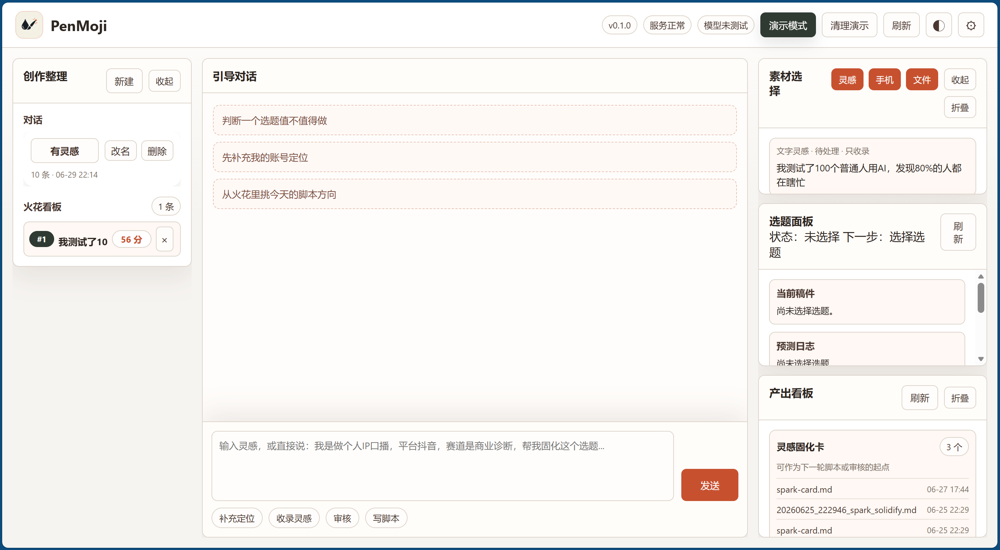
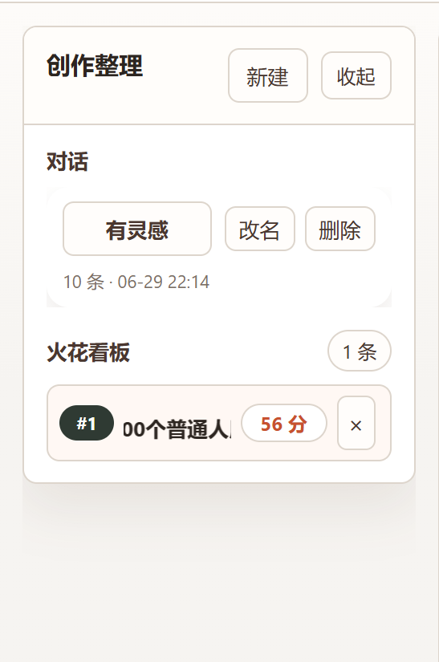
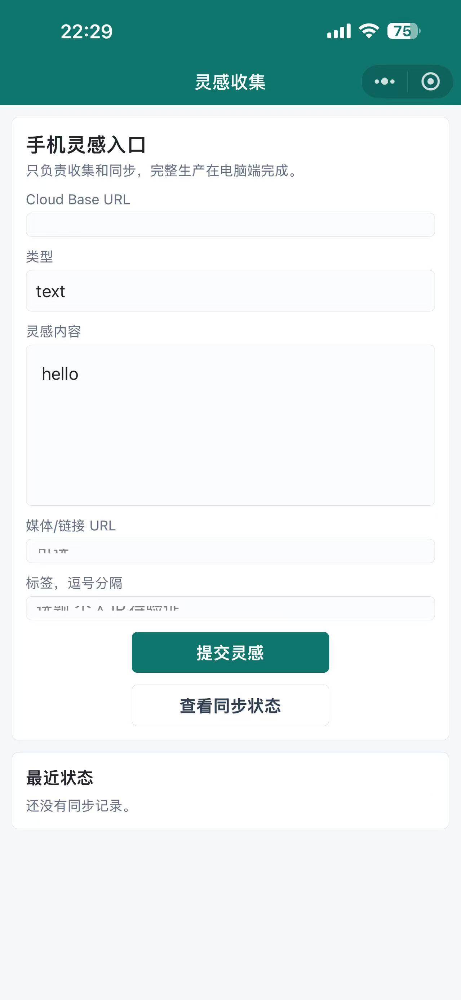

# PenMoji Content Copilot

PenMoji 是一个本地优先的内容创作工作台，帮助自媒体创作者和内容团队把零散灵感推进成可评分、可审核、可发布、可复盘的内容资产。

它不是一个单点写作工具，而是一个从“手机上突然想到一个选题”到“桌面端完成脚本、发布文案和复盘记录”的完整内容工作流。

## 为什么做这个

内容生产的问题通常不是缺少 AI 工具，而是流程断裂：

- 灵感散在微信、备忘录、评论区和临时截图里。
- 选题靠感觉判断，缺少统一评分标准。
- 脚本、发布文案、素材和复盘记录分散保存。
- 团队协作时，很难追踪一个选题从想法到发布后的表现。

PenMoji 把这些环节收进一个本地可控的工作台，让创作者能围绕同一个内容资产持续推进，而不是反复在不同工具之间搬运信息。

## 核心能力

- 手机灵感采集：用微信小程序快速收集想法、链接、评论观察和素材线索。
- 桌面火花看板：把灵感沉淀为可管理的选题，并支持评分、排序和筛选。
- 内容生产链路：围绕选题生成审核意见、视频脚本、发布文案和静态页文案。
- 发布与复盘：记录发布结果、复盘数据和下一轮优化方向。
- 本地优先：用户数据、密钥、对话和产物默认保存在本机。
- 演示友好：内置本地同步验证服务，方便展示从手机采集到桌面生产的闭环。

## 界面预览

### 桌面内容工作台



### 火花评分看板与小程序灵感采集

<table>
  <tr>
    <td align="center" width="50%">
      
    </td>
    <td align="center" width="50%">
      
    </td>
  </tr>
  <tr>
    <td align="center">火花评分看板</td>
    <td align="center">小程序灵感采集</td>
  </tr>
</table>

## 适合谁

- 自媒体创作者：需要把灵感、脚本、发布和复盘放进一个稳定流程。
- 内容团队：需要统一选题判断、沉淀内容资产、减少协作信息丢失。
- 个人 IP 运营者：需要持续生产、复用素材、记录长期内容表现。
- 自托管用户：希望内容数据和 API Key 默认留在本地。

## 工作流

```text
手机采集灵感
  -> 桌面端拉取火花
  -> 评分和筛选选题
  -> 生成审核意见、脚本和发布文案
  -> 登记发布结果
  -> 复盘并校准下一轮内容判断
```

## 业务流程

```mermaid
flowchart LR
    A["产生灵感"] --> B["小程序采集"] --> C["本地同步"] --> D["桌面拉取"]
    D --> E["火花看板"] --> F["评分筛选"] --> G{"继续生产？"}
    G -- "否" --> H["归档 / 暂存"]
    G -- "是" --> I["审稿意见"] --> J["视频脚本"] --> K["发布文案"]
    K --> L["整理素材"] --> M["人工确认"] --> N["发布平台"] --> O["登记数据"] --> P["复盘表现"]
    P --> R["总结规律"]
    R -. "反哺选题" .-> F

    classDef idea fill:#fff4cc,stroke:#d99a00,color:#3d2b00,stroke-width:1px;
    classDef sync fill:#dff7ff,stroke:#118ab2,color:#053047,stroke-width:1px;
    classDef score fill:#e8f7df,stroke:#4f9d3a,color:#173b17,stroke-width:1px;
    classDef produce fill:#f1e7ff,stroke:#7b4fd6,color:#271348,stroke-width:1px;
    classDef publish fill:#ffe5e5,stroke:#d64545,color:#4a1111,stroke-width:1px;
    classDef review fill:#e9ecff,stroke:#4c63d2,color:#151b4d,stroke-width:1px;
    classDef decision fill:#ffffff,stroke:#444444,color:#111111,stroke-width:2px;

    class A,B idea;
    class C,D sync;
    class E,F,H score;
    class G decision;
    class I,J,K,L produce;
    class M,N,O publish;
    class P,R review;
```



## 项目结构

```text
content-workbench/       桌面工作台、本地 API 服务、本地同步服务和测试文档
mobile-miniapp/          微信小程序灵感采集端
docs/                    README 截图和项目说明素材
requirements.txt         Python 依赖清单；当前无第三方依赖
LICENSE                  开源许可证
SECURITY.md              安全和敏感信息说明
```

## 快速开始

运行要求：

- Python 3.10 或更高版本
- 微信开发者工具（仅小程序端需要）
- 当前桌面端不依赖第三方 Python 包

可选：从仓库根目录执行依赖安装命令，当前不会安装额外包：

```powershell
pip install -r requirements.txt
```

启动桌面工作台：

```powershell
cd content-workbench
python main.py --host 127.0.0.1 --port 7870
```

浏览器打开：

```text
http://127.0.0.1:7870
```

也可以双击：

```text
content-workbench\run.bat
```

## 手机同步验证

需要验证小程序到桌面端同步时，先启动本地云端模拟服务：

```powershell
cd content-workbench
python cloud_mock.py --host 127.0.0.1 --port 8787
```

桌面端设置里的“手机同步地址”填写：

```text
http://127.0.0.1:8787
```

桌面端生成绑定码后，小程序输入设备码即可绑定到当前桌面。绑定完成后，小程序提交的灵感会带上目标桌面设备 ID，桌面端按设备拉取。

## 小程序端

用微信开发者工具导入：

```text
mobile-miniapp
```

本地开发时建议开启“不校验合法域名、web-view 域名、TLS 版本以及 HTTPS 证书”。如果用真机调试，`127.0.0.1` 需要替换为电脑的局域网 IP 或正式 HTTPS 地址。

## 数据位置

运行数据保存在安装目录之外：

```text
%USERPROFILE%\.content-workbench
%USERPROFILE%\.content-workbench-cloud
```

这些目录不要上传到 GitHub。仓库里只保留源码、文档和演示/测试所需的静态资源。

## 测试

完整测试说明见：

```text
content-workbench\docs\test-manual.md
```

常用自动检查：

```powershell
python -m py_compile content-workbench\main.py content-workbench\cloud_mock.py content-workbench\tools\mosmori_compliance_tests.py
node --check mobile-miniapp\pages\index\index.js
python content-workbench\tools\mosmori_compliance_tests.py
```

## 当前状态

当前版本适合本地演示、业务流程验证和自托管使用。它可以展示完整内容生产闭环，但还不是成熟 SaaS 产品。

后续生产化范围：

- 正式云端同步服务
- 正式授权/订阅系统
- 安装包和自动升级
- 生产数据库与多用户权限
- 真实平台 API 发布
- 更完整的团队协作能力

## 安全说明

- 不要提交 API Key、授权 token、微信密钥或本地用户数据。
- 不要提交 `%USERPROFILE%\.content-workbench` 和 `%USERPROFILE%\.content-workbench-cloud`。
- 微信开发者工具的个人配置请放在 `mobile-miniapp/project.private.config.json`，该文件已被 `.gitignore` 忽略；仓库只保留 `project.private.config.example.json`。

## 作者

Created by **请叫我奉孝大人**

- GitHub: [SamuelKwj](https://github.com/SamuelKwj)
- Douyin/抖音: `52168570433`
- Related project: [PenMoji Content Copilot](https://github.com/SamuelKwj/PenMoji-content-copilot)

## GitHub Description

```text
PenMoji 是面向自媒体创作者和内容团队的本地优先内容创作工作台，把手机灵感采集、桌面选题评分、脚本生成、发布文案和复盘记录连成一个可自托管流程。
```
